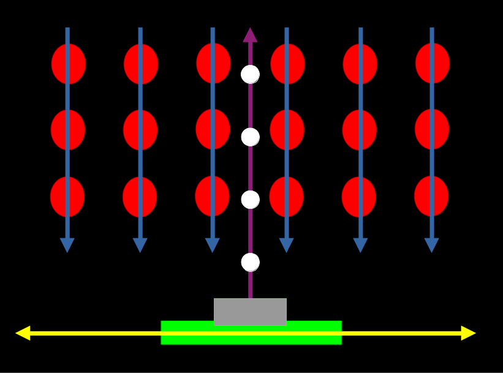

# InvadingAliens
## Descrizione 
Questo è un gioco simile al noto Space Invaders, che utilizza il RetroGameFramework.
- Per la documentazione del framework, fare riferimento al repository originale o alla cartella ```Documentation``` di questo.
- Questo gioco può essere eseguito nativamente su sistemi Windows. Non è garantita la compatibilità tramite Wine, per MacOS o Linux.

## Funzionamento
  Il gioco inizia al momento del lancio. L'utente vedrà una navicella in basso, e dei nemici che compariranno dall'alto dello schermo, che si muoveranno verso la navicella. L'utente finale potrà sparare ai nemici e muoversi, ma non potrà allontanarsi dal bordo inferiore dello schermo. La difficoltà tende ad aumentare con il tempo, come progresso del giocatore. Il giocatore sarà in grado di mettere in pausa il gioco, oltre a muovere la navicella con le freccette e a sparare i proiettili.



In questa immagine, vengono rappresentati gli elementi e i movimenti nel gioco in maniera grossolana.
